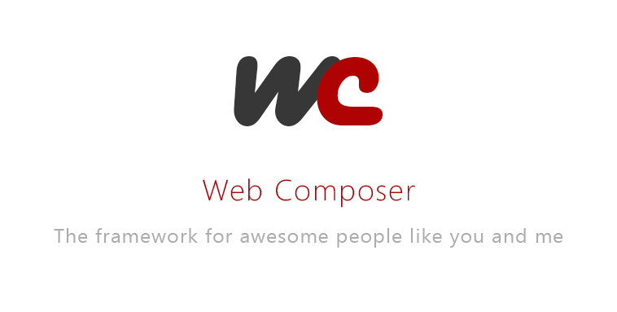

# Web Composer Core Framework

The core component of Web Composer Front End Framework

# Important

* (2019-11-11) [Regenerate Asset Hashes](docs/news/2019-11-11-regenerate-asset-hash.md)
* (2018-10-31) [Dynamic Cashier Mapping](docs/news/2018-10-31-dynamic-cashier-link.md)
* (2018-10-23) [Changes in calling HasAccount](docs/news/2018-10-23-player-object-update-has-account.md)
* (2018-10-18) [Page Cache Middleware Override Alignment](docs/news/2018-10-18-page-cache-middleware-alignment.md)
* (2018-09-20) [Floating Banner Rework](docs/news/2018-09-20-floating-banner-rework.md)
* (2018-07-31) [Slider and Announcement Alignment for Page Caching](docs/news/2018-07-31-slider-announcement-alignment.md)
* (2018-07-20) [Deprecation of GetPlayerDetails](docs/news/2018-07-20-deprecations-player-details.md)
* (2018-03-28) [New Implementation for Drupal Configuration Forms](https://gitlab.ph.esl-asia.com/CMS/drupal-data/blob/working/docs/news/2018-03-28-new-config-form-implementation.md)
* (2018-03-20) [Removal of Deprecated Balance Endpoints](docs/news/2018-03-20-remove-balance-deprecations.md)
* (2018-03-19) [New Metatag Module](docs/news/2018-03-19-new-metatag-module.md)
* (2018-03-14) [Configurable Logo Text](docs/news/2018-03-14-configurable-logo-text.md)
* (2018-02-28) [Deprecation of Some Sync Sections](docs/news/2018-02-28-sync-section-deprections.md)
* (2018-01-29) [Rework of Drupal Settings Implementation](https://gitlab.ph.esl-asia.com/CMS/drupal-data/blob/working/docs/settings-configs-setup.md)
* (2018-01-24) [Rework of Balance with Toggle and Exclusion Lists](docs/news/2018-01-24-balance-update-toggle-exclusion.md)
* (2018-01-23) [Update of Sponsor and Partner Entity Fields](docs/news/2018-01-23-update-sponsor-partner-fields.md)
* (2018-01-17) [Rework of Footer Partners](docs/news/2018-01-17-rework-of-footer-partners.md)
* (2018-01-08) [Rework of Middleware Implementation](docs/news/2018-01-08-rework-of-middlewares.md)
* (2017-12-20) [Rework of Affiliate Tracking](docs/news/2017-12-20-affiliate-rework.md)
* (2017-12-20) [Deprecation of credentials and tracking token](docs/news/2017-12-20-token-deprecation.md)

# Recent News/Updates

* (2020-06-11) [Customizing Page Caching behavior](docs/news/2020-06-11-custom-page-caching-behavior.md)
* (2020-02-06) [GeoIP Language Popup](docs/news/2020-02-06-geoip-language-popup.md)
* (2020-01-02) [Partner Matrix](docs/news/2020-01-02-partner-matrix.md)
* (2019-08-01) [Localization Library](docs/news/2019-08-01-localization.md)
* (2019-07-22) [Curacao Optimization Script](docs/news/2019-07-22-curacao-opt-script.md)
* (2019-07-05) [Sections Query](https://gitlab.ph.esl-asia.com/CMS/wbc-base/blob/working/docs/sections-query.md)
* (2019-07-05) [Asset Prefix](https://gitlab.ph.esl-asia.com/CMS/wbc-base/blob/working/docs/asset-prefix.md)
* (2019-03-13) [Enabling Dynamic Drop Down Menu](docs/news/2019-03-13-activation-dynamic-drop-menu.md)
* (2019-03-11) [Outdated Browser Notification](docs/news/2019-03-11-outdated-browser-notification.md)
* (2018-10-10) [Recommended Marketing Script Format](docs/news/2018-10-10-recommended-market-script-format.md)
* (2018-08-24) [Secure Session](docs/news/2018-08-24-secure-session.md)
* (2018-08-03) [Enable Stale Caching](docs/news/2018-08-03-stale-cache.md)
* (2018-06-21) [Slider Placeholder Image](docs/news/2018-06-21-slider-placeholder.md)
* (2018-06-19) [Bundling Features](docs/bundles.md)
* (2018-06-13) [Enable Fetcher Caching](docs/news/2018-06-13-fetchers-cache.md)
* (2018-05-15) [Saving and Fetching User/Player Preferences](docs/news/2018-05-15-user-preferences.md)
* (2018-05-04) [Enabling the Drawer](docs/news/2018-05-04-drawer.md)
* (2018-05-03) [Adding Custom Headers per Route](docs/routes.md)
* (2018-05-03) [Page Cache Rework](docs/page-caching.md)
* (2018-02-28) [DafaConnect Detection](docs/news/2018-02-28-dafa-connect.md)
* (2018-01-30) [Enabling CDN](docs/news/2018-01-30-enabling-cdn.md)
* (2018-01-17) [Curacao Partners Logo](docs/news/2018-01-17-curacao-partners-logo.md)
* (2018-01-05) [Header Update For Specific ID Domains](docs/news/2018-01-05-id-domains-header.md)
* (2017-12-20) [The new query format](docs/news/2017-12-20-query-format.md)
* (2017-12-05) [Introduction of new Common Sections for performance](docs/news/2017-12-05-common-sections.md)

# Documentation

Framework and component documentation

If you are not familiar with Web Composer, reading the [Startup Guide](docs/startup.md) might help
you get started.

## Getting Started

* [Best Practices](docs/best-practices.md)
* [Routing Basics](docs/basics-routing.md)

## Components Framework

* [Components Widget](docs/components/component-widget.md)
* [Single Page Application Routing](docs/components/single-page-application-routing.md)
* [Defining a 404 page](docs/components/component-404-page.md)

## Framework General Features

* [Sections](docs/sections.md)
* [The Token System](docs/creating-tokens.md)
* [String Translations](docs/string-translations.md)
* [Fetchers](docs/fetchers.md)

## Advanced Features

* [Routes Definition](docs/routes.md)
* [Page Caching](docs/page-caching.md)
* [Using a Cache Adapter](docs/caching.md)
* [Activate Single Signon](docs/sso.md)
* [About Async](docs/async.md)
* [Metrics Logging](docs/metrics-log.md)

## Forms

* [Adding a Configurable Form](docs/configurable-form.md)
* [Adding Form validations](docs/form-validations.md)

## Game Launching

* [How to Define Launchable Games](docs/game-launch.md)
* [How to add a new Game Provider](docs/game-provider.md)

## Site Components

* [Adding a Sitemap](docs/sitemap.md)
* [Adding a Robots.txt](docs/robots.md)
* [Avaya Livechat Integration](docs/avaya.md)
* [Adelement Integration](docs/adelement.md)
* [Adding Push Notification](docs/pushnx.md)
